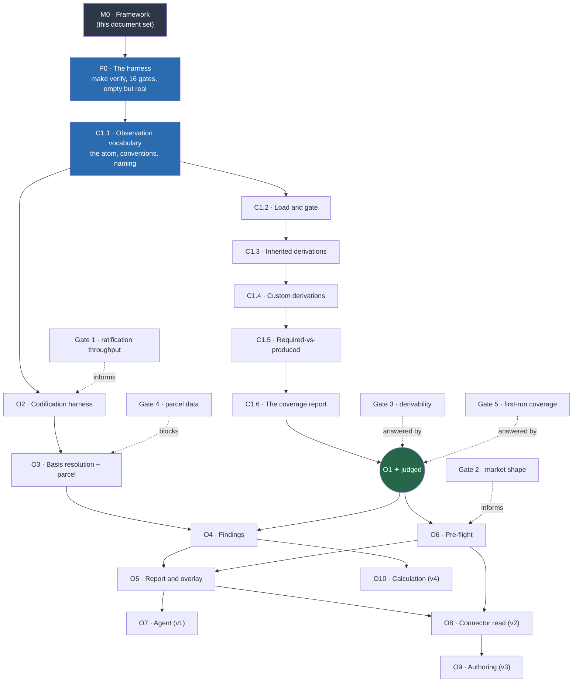

# Dependency order

**The graph is the schedule.** There is no separate schedule.

Under `docs/process/decomposition.md` Rule 2, no part is started while anything it depends on
is unbuilt. Not started against a stub, not started against a mock, not started in parallel
"and integrated later". Every task spec names its prerequisites and the evidence each is
complete, and a subagent whose prerequisite evidence is missing stops without starting.

## The full graph

## What is startable right now

| | |
| --- | --- |
| **Startable** | **P0 — the harness.** Its only prerequisite is this framework. |
| **Startable after P0** | C1.1, the observation vocabulary. |
| **Everything else** | Blocked. Not "deprioritized" — blocked, by the rule. |

P0 comes first for a reason that is not sequencing convenience: **the guards must exist before
the code they guard.** A jurisdiction guard added after three modules are written finds
violations in code that already has dependents. Added first, it finds them in the diff that
creates them.

## Fieldwork, running in parallel

`prd.md` §11's gates are not code and are not blocked by it. Three of the five are yours.

| Gate | Question | Blocks | Cost |
| --- | --- | --- | --- |
| **Gate 1** | How many clause records per day can one expert ratify, and what fraction of drafts survive unedited? | Nothing structurally — but it sets every coverage target. Also measures the quote-linter failure rate, which is the size of the confident-wrong-PASS risk. | One chapter. Cheapest thing on the list. |
| **Gate 2** | What fraction of offices submitting to plan review author in semantic BIM rather than 2D? | Decides whether v0 has reachable users, and which hosts O6 targets. | Twenty phone calls. No files, no engineering. |
| **Gate 3** | Do five real models from five offices carry bounded spaces, storey elevations, and derivable quantities? | **Answered by O1.** But the five models are yours to obtain, and O1 cannot be judged without them. | Five files. |
| **Gate 4** | Can cadastral boundary and zoning envelope data be obtained for a real parcel in a joinable form? | **Hard-blocks O3.** Two v0 checks depend on it entirely, and the answer is currently assumed. | One parcel, one request. |
| **Gate 5** | What does the coverage manifest actually say, and does it read as a coverage statement or as a broken tool? | **Answered by O1**, in front of a real architect. `prd.md` calls this the single largest product-design question in v0. | The O1 output plus one conversation. |

**The one thing needed to make O1 judgeable is five real IFC models** (Gate 3). Everything up
to C1.6 can be built against generated fixtures; the judgement cannot.

## Rules for reading this graph

1. **An edge is a hard block.** No stubbing across one.
2. **A dotted edge is information, not a block.** Gate 2 informs which host O6 targets; it does not stop O1.
3. **The graph changes only by decision record.** Discovering a missing edge mid-task means stopping and recording it, not routing around it.
4. **A node is complete when its evidence exists**, per `docs/process/definition-of-done.md` — not when its code is written.
