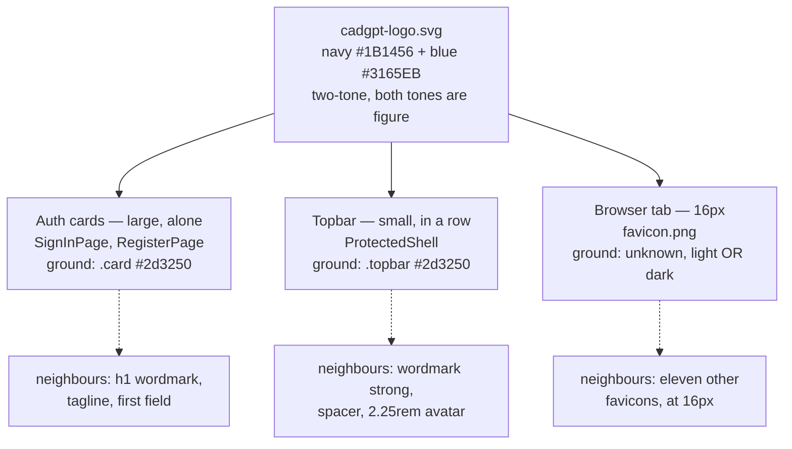

# Flow: the brand mark's surfaces

Story: `docs/product/user-stories/brand-mark.md`
Preview: `design-previews/brand-mark/index.html`
Workbench: `Screens/Sign in/*`, `Screens/Projects/*` (the topbar is in every `Screens/…` story)

This feature adds no screen and no transition — `docs/ux/page-graph.md` is unchanged by it.
What it has instead of a flow is a **surface map**: the mark is chrome, so the thing that has
to be enumerated is not "which state comes next" but "which grounds does this one asset have
to survive, at which sizes, next to what."

## The surfaces

| Surface | File | Rendered at | Ground | Alone or in a row |
|---|---|---|---|---|
| Sign in | `features/auth/SignInPage.tsx` | `.brand-mark-lg`, 3.5rem | `.card` `#2d3250` over the `.centered` radial wash | Alone; first thing above `h1` |
| Create account | `features/auth/RegisterPage.tsx` | `.brand-mark-lg`, 3.5rem | identical | identical |
| App shell topbar | `app/ProtectedShell.tsx` | `.brand-mark`, 1.75rem | `.topbar` `#2d3250` | In a row: wordmark at `--text-lg` bold, `--space-3` gap, spacer, `2.25rem` avatar |
| Browser tab | `public/favicon.png`, linked from `index.html` | 16–32px, browser's choice | **not ours** — Chrome's tab strip is near-white in light mode, `#35363a` in dark | Among every other open tab |

## What each surface actually demands

**The tab is the strict one and it is usually the one that gets skipped.** It is the only
surface whose ground we do not control, so it is the only one where "make the mark work on
our background" is not even an available move. Any answer that solves the two in-product
surfaces by changing the *page* rather than the *asset's immediate ground* leaves the favicon
unsolved and produces a third variant — which the story rules out.

**The topbar is a composition problem, not only a legibility one.** The mark is currently a
child of `.topbar`'s flex with the same `--space-3` gap as every other child, so the wordmark
is not bound to it: they read as two items that happen to be adjacent. And at 1.75rem the
mark is visibly lighter than the 2.25rem avatar at the other end of the bar, so the bar is
asymmetric in a way nobody chose.

**The auth card is the only place the mark is the focal point.** It is also the only place
the mark and the wordmark are stacked, which means whatever the mark sits in has to look
deliberate at 3.5rem — a treatment that reads as a tasteful detail at 28px can read as a
sticker at 56px, and the check has to happen at both sizes or it has not happened.

## States

The mark has no interactive states — it is not a link, not a button, and carries `alt=""`
because the wordmark beside it is the accessible name. What it has instead is *grounds*, and
those are the rows above. The preview covers all four, at their real sizes, plus the two tab
grounds the browser may hand us.

## Non-states worth naming

- **No hover, no focus.** If the mark ever becomes a home link, it acquires both and this
  file is wrong. It is not one today.
- **No loading state.** The asset is a bundled PNG served from the same origin; there is no
  window in which the mark is pending and something else must stand in for it.
- **No dark/light branch.** One theme (T-0071). The only place a light ground exists in this
  product is whatever this work introduces.
