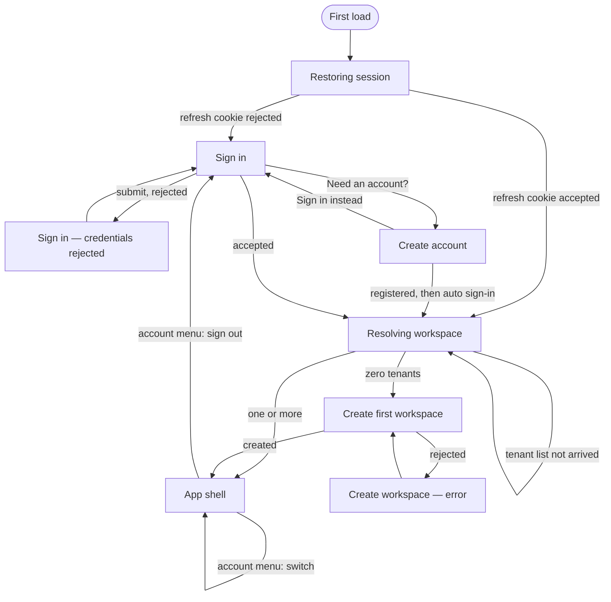

# Flow: onboarding and workspace

Story: `docs/product/user-stories/onboarding-and-workspace.md`
Workbench: `Screens/Sign in/*`, `Screens/Workspace/*`

## States

| State | Looks like | Workbench story |
|---|---|---|
| **Restoring session** | An empty `.centered` frame over the accent wash. No spinner, no wordmark — it is normally one request long. | — (transient; visible in any story for a moment) |
| **Sign in** | One card: wordmark, tagline, email, password, submit, and the link to register. | `Screens/Sign in/Idle` |
| **Sign in — rejected** | The same card with `.error` above the button, carrying the server's own sentence. The fields keep their values. | `Screens/Sign in/Credentials Rejected` |
| **Create account** | The same card shape, two fields, and a link back. Registering signs you in immediately afterwards. | `Screens/Sign in/Register` |
| **Resolving workspace** | An empty `.centered` frame again — deliberately identical to Restoring, because until the tenant list arrives the app genuinely does not know which of the next two states applies. | — |
| **Create first workspace** | One name field. The slug is derived, with a random suffix, and never shown. | `Screens/Workspace/First Workspace` |
| **App shell** | Topbar with wordmark and avatar; breadcrumbs; the routed page. | every `Screens/…` story |
| **Account menu open** | Panel naming the workspace and the signed-in email, the workspace switcher when there is more than one, and sign-out in `--fail`. | `Screens/Projects/Changelist/Two Workspaces` (open the avatar) |

## Notes on the transitions

**The two blank frames are the interesting part.** `!ready` and "signed in, tenant list not
yet arrived" render identically and on purpose: rendering the shell in the second case would
put an account menu on screen with no workspace to name, and rendering the create-workspace
screen would tell a user with three workspaces that they have none.

**Switching workspace navigates.** Any route below `/projects` carries a uuid belonging to
the tenant being left, so both the switch and the sign-out force a navigation rather than
leaving the current URL in place.

**Registration errors are known-incomplete.** `RegisterPage` renders `ApiError.message`
only and discards `fieldErrors`, so the password policy is never stated — T-0068, still
open. The workbench does not yet carry a story for that state; adding one belongs with the
fix.
