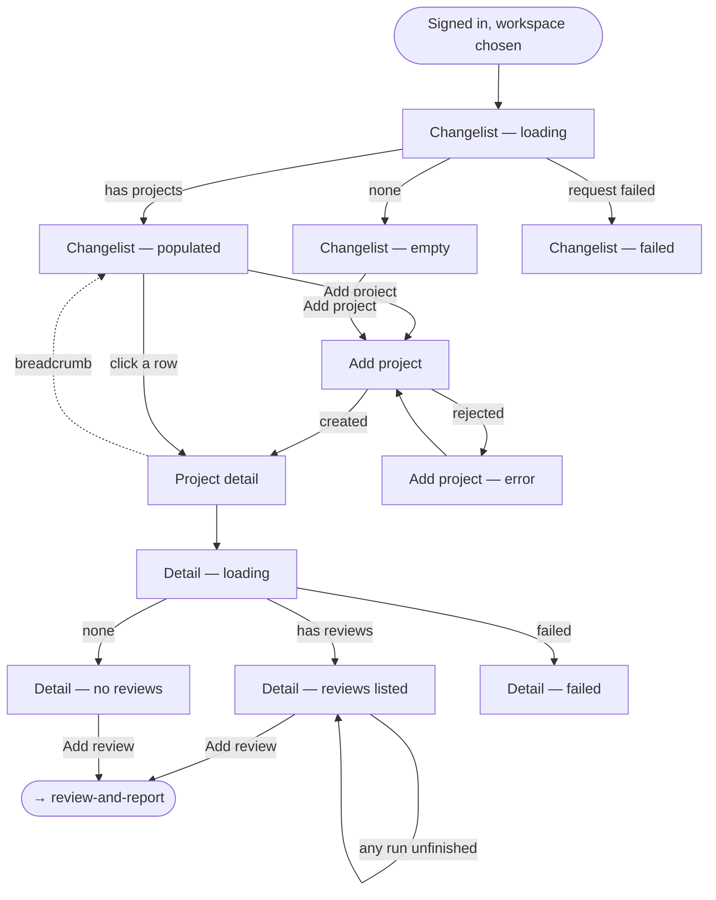

# Flow: projects changelist

Story: `docs/product/user-stories/project-changelist.md`
Workbench: `Screens/Projects/*`, `Screens/Project/*`

## States

| State | Looks like | Workbench story |
|---|---|---|
| **Changelist — loading** | Card, heading and "Add project" present; no table. There is no spinner in this app. | `Screens/Projects/Changelist/Loading` |
| **Changelist — populated** | Three columns: name, review count, created. Whole rows are clickable. | `…/Populated` |
| **Changelist — empty** | One muted sentence naming the next step. | `…/Empty` |
| **Changelist — failed** | `.error` and no table. Never the empty state. | `…/Failed` |
| **Add project** | One field, one button. Lands on the new project's detail page. | `Screens/Projects/Add/Idle` |
| **Detail — loading** | Heading falls back to `…`; the add action is already usable. | `Screens/Project/Detail/Loading` |
| **Detail — reviews listed** | Five columns: name, model file (LTR), status, outcome pill, latest run. Refetches every 2s while any run is unfinished. | `Screens/Project/Detail/Populated` |
| **Detail — no reviews** | One muted sentence. | `…/No Reviews` |
| **Detail — failed** | `.error`, no table. | `…/Failed` |

## Notes

**Loading has no spinner anywhere in this flow.** The frame, its heading and its primary
action render immediately and only the data-dependent part is withheld. That is a real
decision worth keeping consistent, not an oversight — it is why the "loading" stories look
almost like the empty ones and why the empty state must carry a sentence to tell them apart.

**Error and empty are never the same screen.** Both changelist and detail treat a failed
query as its own state, because an empty table under a failed request asserts something
false about the tenant's data.

**The detail page fetches its own project.** It does not read the changelist's cache, so a
detail URL opened cold — a reload, a bookmark, a story that starts three levels deep —
works on its own.
