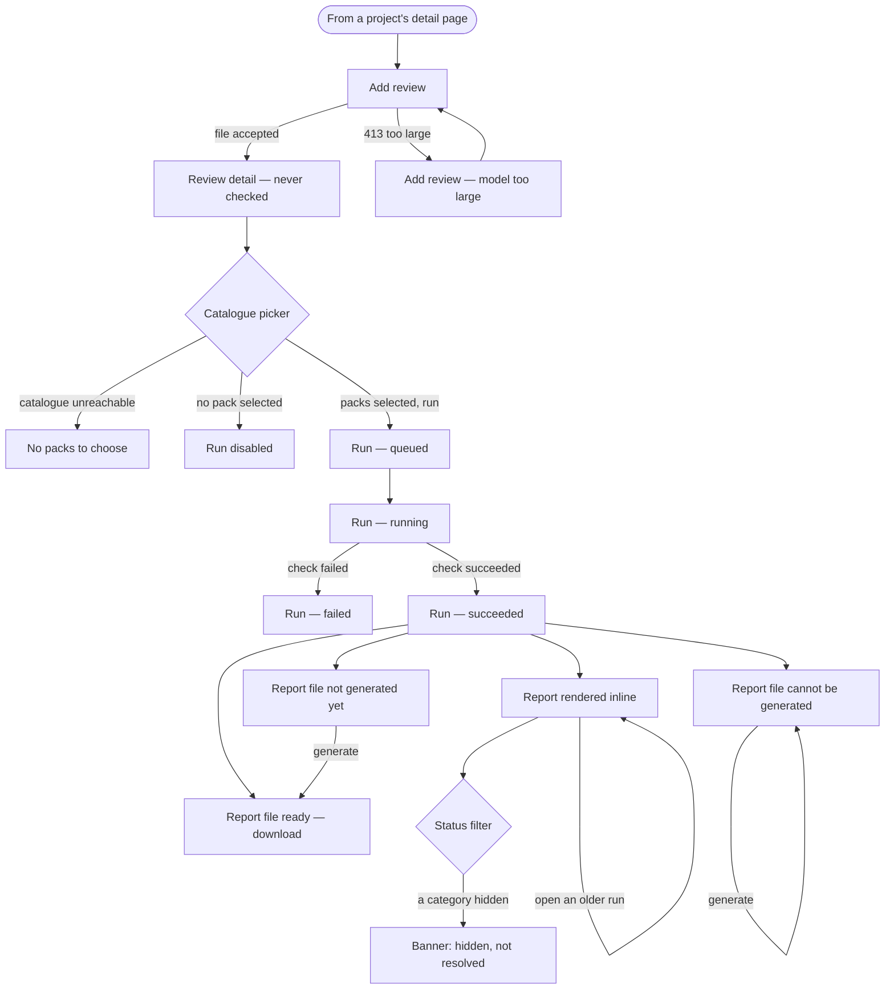

# Flow: review and report

Story: `docs/product/user-stories/review-and-report.md`
Workbench: `Screens/Review/*`, `Components/Report/*`

## States

| State | Looks like | Workbench story |
|---|---|---|
| **Add review** | Name, file input with the enforced ceiling stated beneath it. No rule-set field. | `Screens/Review/Add/Idle` |
| **Model too large** | `.error` carrying the server's 413 wording, so the stated limit is the enforced one. | `…/Model Too Large` |
| **Never checked** | Catalogue picker: three free-text filters, a checkbox list of packs, a run button disabled until one is selected. Run history says "not checked yet". | `Screens/Review/Detail/Never Checked` |
| **No packs to choose** | The picker with "no packs match this filter" and nothing runnable. | `…/Catalogue Failed` |
| **Queued / running** | Button reads "Checking…" and is disabled; history row shows Queued then Running. Polled at 1.5s (open run) and 2s (history). | `…/Running`, and live in `…/Never Checked` |
| **Run failed** | History row reads Failed. **No reason is shown** — see below. | `…/Run Failed` |
| **Succeeded + report** | Disclosure, then coverage, then findings. | `…/Checked` |
| **Report file ready** | A download button that fetches the bytes with the bearer token and hands the browser a blob — not a bare link, which could not carry the token. | `…/Checked` |
| **File not generated yet** | Says *yet*, and offers generation. | `…/Report File Not Generated` |
| **File cannot be generated** | `.error` with the permanent reason, retry still offered. | `…/Report File Failed` |
| **Filter active** | Banner stating how many findings are hidden rather than resolved; the three counts do not move. | `…/Checked` — untick a box |

## The report's own order

Disclosure → coverage → findings, and it is not arbitrary. "What artifact did this check at
all" is prior to "how much of the rule set was evaluated", which is prior to "what did it
find". A reader who stops after the counts has still been told what was not checked.

Findings sort FAIL, then INDETERMINATE, then PASS, stably. The status filter offers FAIL
and INDETERMINATE only: passing entities are counted but never itemised, so a PASS filter
would always render an empty list and read as "no passes found" — the inversion of the
truth.

## Known gaps in this flow

- **A failed run gives no reason.** `failure_reason` and `failure_detail` are on the wire
  and are rendered nowhere in `services/web/src` — verified by grep, 2026-09-06. The
  history row says "Failed" and stops. `Screens/Review/Detail/Run Failed` is the story that
  shows this; the fixture carries a real reason that the screen does not display.
- **The report overflows horizontally below roughly 640px** — measured at +318px on a
  390px viewport. The `.entities` table sets fixed per-column widths inside
  `table-layout: fixed`.
- **The catalogue's three filters are placeholder-only**, with no `<label>`, against this
  app's own established pattern.

All three were found by the workbench on its first run (T-0079) and are queued as T-0080,
T-0081 and T-0082. None is fixed yet.
