# Page Graph

Every screen in `services/web`, and how a person reaches it. Seeded on 2026-09-06 by walking
`src/app/router.tsx` and the branches in `src/app/App.tsx` — not from memory, and not
aspirational: everything below is a route or a render branch that exists today.

This is a living document. A feature that adds, moves, or retires a screen updates this file in
the same change. A removed page is marked removed rather than deleted, so the file stays a
record someone can trust.

```mermaid
flowchart LR
    Start([First load]) --> Restoring[/"Restoring session<br/>(blank .centered)"/]

    subgraph Unauthenticated
        SignIn[Sign in]
        Register[Create account]
        SignIn <--> Register
    end

    subgraph NoWorkspace["Signed in, no workspace"]
        Resolving[/"Resolving workspace<br/>(blank .centered)"/]
        CreateWorkspace[Create first workspace]
    end

    subgraph Shell["App shell — topbar, account menu, breadcrumbs"]
        Projects[Projects changelist]
        ProjectNew[Add project]
        ProjectDetail[Project detail<br/>— its reviews]
        ReviewNew[Add review]
        ReviewDetail[Review detail<br/>— packs, runs, report]
    end

    Restoring -->|no refresh cookie| SignIn
    Restoring -->|session restored| Resolving
    Register -->|registered| Resolving
    SignIn -->|signed in| Resolving
    Resolving -->|zero tenants| CreateWorkspace
    Resolving -->|has a tenant| Projects
    CreateWorkspace -->|created| Projects

    Projects -->|Add project| ProjectNew
    ProjectNew -->|created| Projects
    Projects -->|click a row| ProjectDetail
    ProjectDetail -->|Add review| ReviewNew
    ReviewNew -->|created| ReviewDetail
    ProjectDetail -->|click a row| ReviewDetail

    ReviewDetail -.breadcrumb.-> ProjectDetail
    ProjectDetail -.breadcrumb.-> Projects
    Shell -.account menu: switch workspace.-> Projects
    Shell -.account menu: sign out.-> SignIn
```

## Page index

| Page | Route | Purpose | Entry points | Flow doc |
|---|---|---|---|---|
| Restoring session | — (`App`, `!ready`) | Blank frame while the refresh cookie is tried | first load | onboarding-and-workspace |
| Sign in | — (`App`, `!user`) | Authenticate | first load with no session; sign-out | onboarding-and-workspace |
| Create account | — (`App`, `!user`) | Register | Sign in | onboarding-and-workspace |
| Resolving workspace | — (`App`, no tenant, no list yet) | Blank frame; withheld so "fetching" and "has none" cannot render alike | after sign-in | onboarding-and-workspace |
| Create first workspace | — (`App`, zero tenants) | `POST /v1/tenants/`, slug derived | signed in with no tenant | onboarding-and-workspace |
| Projects changelist | `/projects` | Every project the tenant owns, with review counts | `/` redirect; breadcrumb; workspace switch | project-changelist |
| Add project | `/projects/new` | Name only | Projects "Add project" | project-changelist |
| Project detail | `/projects/$projectUuid` | This project's reviews and their latest run | Projects row; breadcrumb | project-changelist |
| Add review | `/projects/$projectUuid/reviews/new` | Name + IFC upload | Project detail "Add review" | review-and-report |
| Review detail | `/projects/$projectUuid/reviews/$reviewUuid` | Rule-pack picker, run history, inline report | Project detail row; after creating a review | review-and-report |

## Notes on the shape

**Four screens have no route of their own.** Restoring, Sign in, Create account, Resolving and
Create-workspace are all branches inside `App`, chosen before the router's `<Outlet />` is ever
reached. There is no `/login` URL. The consequence is that authentication state is not
addressable or linkable — deliberate today, worth revisiting if anything ever needs to deep-link
into an unauthenticated view.

**`/` is a redirect, not a dashboard.** T-0074 replaced the single-page dashboard with the
Django-admin changelist shape; `/` throws a redirect to `/projects` in `beforeLoad`.

**Static beats dynamic at the same depth.** `/projects/new` and `/projects/$projectUuid` are
siblings, as are `/projects/$projectUuid/reviews/new` and `.../reviews/$reviewUuid`. TanStack
Router matches the static segment first, so no explicit priority list is needed.

**The account menu can navigate.** Switching workspace and signing out both force
`navigate({ to: "/projects" })` / `{ to: "/" }`, because a project or review uuid in the current
URL belongs to the tenant being left and would 404 in the next one.

## Removed

- **Reviews dashboard** (`ReviewsPage.tsx`, one page holding rule sets, review creation, review
  list and report) — removed by T-0074 in favour of the changelist/add/detail split above. Its
  rule-set upload card and `rule_set` select were removed separately; see `docs/decisions.md`,
  2026-09-04.
